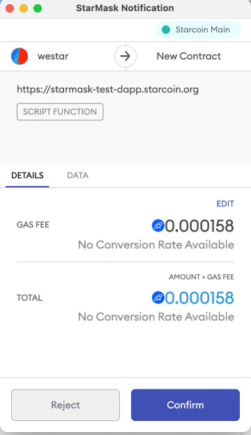

# Interaction with the contract by RPC and SDK

Generally, there are 4 steps for a dapp to interact with the Starcoin blockchain:

1. Connect to StarMask
2. Generate the rawUserTransaction hex string while calling the contract with params
3. Wake up the StarMask and asking the user to confirm the transaction
4. Wait until the transaction was confirmed on the Starcoin blockchian, and display the result

Let's explain each steps in details with examples from [starmask-test-dapp](https://github.com/starcoinorg/starmask-test-dapp).

## 1. Connect to StarMask

To interact with the Chrome extension StarMask, a Dapp must check wether it is installed or not:

```js
import StarMaskOnboarding from "@starcoin/starmask-onboarding";

const { isStarMaskInstalled } = StarMaskOnboarding;

let onboarding;
try {
  onboarding = new StarMaskOnboarding({ forwarderOrigin });
} catch (error) {
  console.error(error);
}

const onClickInstall = () => {
  onboardButton.innerText = "Onboarding in progress";
  onboardButton.disabled = true;
  onboarding.startOnboarding();
};

if (!isStarMaskInstalled()) {
  onboardButton.innerText = "Click here to install StarMask!";
  onboardButton.onclick = onClickInstall;
  onboardButton.disabled = false;
} else if (isStarMaskConnected()) {
  onboardButton.innerText = "Connected";
  onboardButton.disabled = true;
  if (onboarding) {
    onboarding.stopOnboarding();
  }
}
```

If StarMask is installed, it will inject a global object `window.starcoin` into the Dapp, then we can use it to connect to StarMask,
and get the connected account address:

```js
const handleNewAccounts = (newAccounts) => {
  accounts = newAccounts;
  accountsDiv.innerHTML = accounts;
};

const onClickConnect = async () => {
  try {
    const newAccounts = await window.starcoin.request({
      method: "stc_requestAccounts",
    });
    handleNewAccounts(newAccounts);
  } catch (error) {
    console.error(error);
  }
};
```

## 2. Generate the rawUserTransaction hex string while calling the contract with params

If we want to call a contract(execute a transaction), for example, `0x1::TransferScripts::peer_to_peer_v2` can transfer any amount of any token to others.

First, we need to confirm the contract's params number and type.

[here](https://github.com/starcoinorg/starcoin-framework/blob/main/sources/TransferScripts.move#L15) is the source code of `0x1::TransferScripts::peer_to_peer_v2`:

```
public(script) fun peer_to_peer_v2<TokenType: store>(account: signer, payee: address, amount: u128) {
```

omit the first param(type is `signer`), we need to pass 2 params while calling this contract on dapp:

1. `payee`, type is `address`
2. `amount`, type is `u128`

Second, we need to generate the scriptFunction while calling the contract with the corresponding params.

There are two ways to generate the scriptFunction. One is `utils.tx.encodeScriptFunction`:

```js
import { utils } from "@starcoin/starcoin";

const functionId = "0x1::TransferScripts::peer_to_peer_v2";
const strTypeArgs = ["0x1::STC::STC"];
const tyArgs = utils.tx.encodeStructTypeTags(strTypeArgs);

const toAccount = document.getElementById("toAccountInput").value;

const BIG_NUMBER_NANO_STC_MULTIPLIER = new BigNumber("1000000000");
const sendAmountSTC = new BigNumber(
  String(document.getElementById("amountInput").value),
  10
);
const sendAmountNanoSTC = sendAmountSTC.times(BIG_NUMBER_NANO_STC_MULTIPLIER);
const sendAmountHex = `0x${sendAmountNanoSTC.toString(16)}`;

// Multiple BcsSerializers should be used in different closures, otherwise, the latter will be contaminated by the former.
const amountSCSHex = (function () {
  const se = new bcs.BcsSerializer();
  se.serializeU128(BigInt(sendAmountNanoSTC.toString(10)));
  return hexlify(se.getBytes());
})();

const args = [arrayify(toAccount), arrayify(amountSCSHex)];

const scriptFunction = utils.tx.encodeScriptFunction(functionId, tyArgs, args);
```

> Check [BCS in JS SDK](./05-understanding-resource-and-bcs/02-bcs-in-js.md) for more details.

If we don't want to manually generate the bcs of each element of array typeArgs and args, we can use `utils.tx.encodeScriptFunctionByResolve` directly.

```js
const functionId = "0x1::TransferScripts::peer_to_peer_v2";
const tyArgs = ["0x1::STC::STC"];
const toAccount = document.getElementById("toAccountInput").value;
const BIG_NUMBER_NANO_STC_MULTIPLIER = new BigNumber("1000000000");
const sendAmountSTC = new BigNumber(
  String(document.getElementById("amountInput").value),
  10
);
const sendAmountNanoSTC = sendAmountSTC.times(BIG_NUMBER_NANO_STC_MULTIPLIER);
const args = [toAccount, sendAmountSTC];

const nodeUrl = nodeUrlMap[window.starcoin.networkVersion];

const scriptFunction = await utils.tx.encodeScriptFunctionByResolve(
  functionId,
  tyArgs,
  args,
  nodeUrl
);
```

Finally, geneate the rawUserTransaction hex string:

```js
const payloadInHex = (function () {
  const se = new bcs.BcsSerializer();
  scriptFunction.serialize(se);
  return hexlify(se.getBytes());
})();
```

## 3. Wake up the StarMask and asking the user to confirm the transaction

```js
const txParams = {
  data: payloadInHex,
};

const transactionHash = await starcoinProvider
  .getSigner()
  .sendUncheckedTransaction(txParams);
```

The StarMask will pop up a transaction confirm page, display the estimated gas fee in the `DETAILS` tab ,and the scriptFunction params and the hex string in the `DATA` tab.



User can either `Reject` or `Confirm` this transaction.

> Tips: before user click either of these two buttons, the Dapp should display a Loading status.

## 4. Wait until the transaction was confirmed on the Starcoin blockchian, and display the result

A transaction must be confirmed by enough nodes, we can change this in the constant variable `MAX_CONFIRMED_NODES`.
We need to display a loading status, and long polling the staus of the transaction using `transactionHash`, and check the confirmations of the response, and cancle the loading status until confirmations is equal to or larger than `MAX_CONFIRMED_NODES`.

```js
const MAX_CONFIRMED_NODES = 6;
contractStatus2.innerHTML = `Transaction is waiting confirmed `;
let timer = setInterval(async () => {
  const txnInfo = await starcoinProvider.getTransactionInfo(transactionHash);
  if (txnInfo.status === "Executed") {
    contractStatus2.innerHTML = `Transaction ${txnInfo.confirmations} confirmed `;
    if (txnInfo.confirmations >= MAX_CONFIRMED_NODES) {
      clearInterval(timer);
      contractStatus2.innerHTML = "Call Completed";
      callContractButton.disabled = false;
    }
  }
}, 3000);
```

## Reference

- [Starcoin JS SDK](https://starcoin.org/zh/developer/sdk/javascript/)

- [StarMask Test Dapp](https://github.com/starcoinorg/starmask-test-dapp).

- [Developing Dapp with React](https://github.com/starcoinorg/starcoin-test-dapp-react)

- [Developing Dapp with Vue3](https://starcoin.org/zh/developers/others/how_to_use_vue_to_develop_dapp/)
