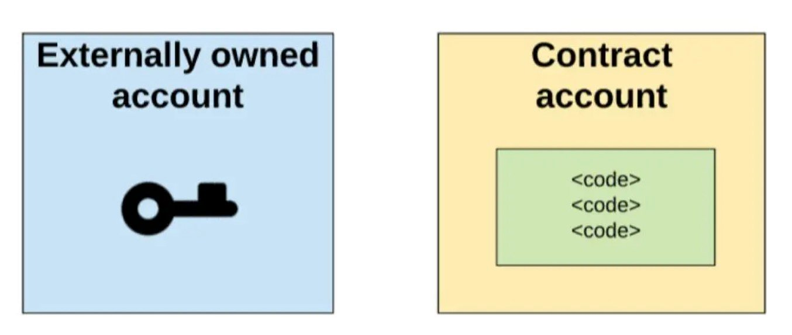
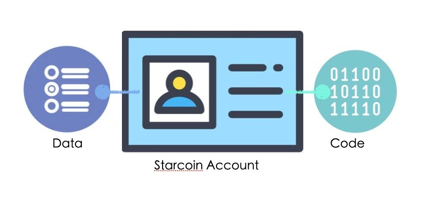
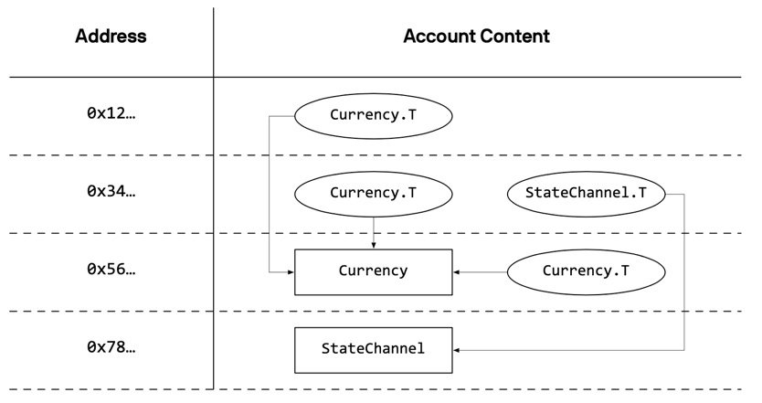

# Contract Account and SignerDelegated

## 从以太坊的合约账户说起

对比比特币，以太坊最大的创新是引入智能合约，智能合约让区块链拥有了强大的表达能力。
而智能合约的背后，是全新的账户模型。跟比特币的UTXO模型不同，以太坊采用了Account模型。
以太坊有两种类型的Account，分别是外部账户(Externally Owned Account)和合约账户(Contract Account)。
这两种账户之间主要有三个方面的差异：


../../../../../../static/img/contract_account/

* 创建方式
* 是否有合约代码
* 能否主动发起交易

外部账户需要通过私钥创建，是面向普通用户的账户，只能存储当前用户的Balance，不允许有代码。用户通过私钥控制账户，主动发起交易，是普通用户的入口。而合约账户由外部账户的Address等数据计算而来，可以存储代码。账户状态由合约控制，存储通过合约产生的所有数据。


这两种账户本质上是希望将用户状态与合约状态分开存储。但是随着区块链的高速发展，以太坊的账户模型面临很多的问题：

1. 合约产生的状态越来越多、越来越大；
2. 所有用户的合约数据都存储在相同的合约账户下：
   * 容易产生安全隐患（例如大数组问题）；
   * 数据没有明确的所有权；
3. 没法按状态付费；
4. ETH是一等公民，存储在用户Balance下；ERC20是二等公民，存储在合约账户下；
5. 合约调用的Context理解起来比较复杂，容易引起安全问题；
6. 代码和状态没有分开存储；

以太坊在Account模型上做了很多创新，但是随着区块链的快速发展，很多设计上的缺陷也越来越明显。
由于Account模型对智能合约的支持非常友好，Starcoin也采用了Account模型。
跟以太坊的Account模型对比，Starcoin的Account模型有非常大的优势，在继承Account模型优势的基础上，很好的弥补了以太坊Account模型的不足。

## 更先进的Account模型

为了更好地为广大用户提供服务，Starcoin的Account模型设计了Data区和Code区。
Data区用于存储用户数据，Code区用于存储合约代码，彻底将“用户数据”与“合约代码”分开存储。



由于Starcoin的智能合约语言Move是面向资源编程的，合约生成的Resource在Move虚拟机的保障下，只能在账户之间转移，不能被修改（修改必须调用合约）。
所以，在Starcoin的账户模型上运行Move合约有非常多的优势：

* 账户区分Data区和Code区，合约存储在账户Code区
* 任何账户都可以同时包含Data和Code
* 数据分散存储在用户自己的Data区，而不是集中存储到合约账户下
* 明确Resource的所有权，提升了安全性
* 所有Token（包括STC）都通过相同的Token协议注册，遵循相同的规范
* 为状态计费提供可能，避免了“状态爆炸”
* 将状态与代码拆分，让合约调用有清晰的上下文




## Starcoin的合约账户

前面对比了Starcoin和以太坊的账户模型，可以说，Starcoin有更先进的账户模型。
任何一个Starcoin账户可以同时存储Data和Code，能覆盖以太坊的所有场景。
为了扩展更丰富的应用场景，Starcoin也设计了合约账户，所以，Starcoin跟以太坊一样也包含外部账户(Externally Owned Account)和合约账户(Contract Account)。
但是，Starcoin的合约账户跟以太坊的合约账户有非常大的区别。接下来我们从以下3个方面，深入介绍Starcoin的合约账户。

### 1. Starcoin合约账户

因为设计目标不一样，Starcoin的合约账户跟以太坊的合约账户有非常大的区别。Starcoin的合约账户有以下特点：

* Starcoin的合约账户本质上是把签名权托管了，除了没有签名权，其他的方面跟Starcoin的外部账户完全一致
* Starcoin的账户实现是统一的，合约账户和外部账户之间可以相互转换
* Starcoin的合约账户没有签名权，跟以太坊的合约账户一样不能主动发起交易

### 2. Starcoin如何实现合约账户

 Starcoin的账户代码在Stdlib的Account.move合约中，实现了外部账户(Externally Owned Account)和合约账户(Contract Account)。
 而跟合约账户相关的Move代码非常的简洁和巧妙，充分利用了Move的优势和特点。以下是Starcoin合约账户的主要实现：

```
// SignerDelegated can only be stored under address, not in other structs.
struct SignerDelegated has key {}
// SignerCapability can only be stored in other structs, not under address.
// So that the capability is always controlled by contracts, not by some EOA.
struct SignerCapability has store { addr: address }

public fun is_signer_delegated(addr: address): bool {
    exists<SignerDelegated>(addr)
}

native fun create_signer(addr: address): signer;
```

上面的代码中，包含两个Struct：

* SignerDelegated：存储在合约账户下的一个标记性质的资源，不能拷贝、不能丢弃、不能修改、不能转移，一个账户下如果有SignerDelegated表示合约账户，否则是外部账户
* SignerCapability（Capability是Move合约中常用的编程思想，通常表示权限）：表示合约账户addr的签名权，谁掌握了addr的SignerCapability，谁就能控制addr账户。SignerCapability也是不能拷贝、不能丢弃、不能修改，只能转发的资源


SignerDelegated像是一把锁，SignerCapability像是一把钥匙。代码中还包括两个函数：

* is_signer_delegated：在校验交易的时候调用is_signer_delegated函数进行判断，禁止合约账户主动发起交易（因为合约账户没有签名权，不能主动发起交易）
* create_signer：create_signer是native的，拥有addr的SignerCapability的账户可以调用create_signer函数，通过代码切换到addr合约账户，以addr合约账户的身份运行任何合约代码。

以上是Starcoin合约账户的主要实现。Starcoin将addr合约账户的签名权SignerCapability进行托管，实现在合约代码中「切换账户」的能力。这么做有什么好处呢？我们在后面讨论合约账户的应用场景的时候再讨论。


### 3. 创建Starcoin合约账户

前面我们说过，Starcoin的账户实现是统一的，合约账户和外部账户之间可以相互转换。跟以太坊的合约账户创建流程不同，Starcoin的合约账户创建流程只是在外部账户创建流程的基础上，多了一步“托管签名权”。下图是Starcoin创建账户的流程，最后紫色→和紫色+表示通过外部账户创建合约账户。


## 合约账户应用场景

Starcoin将addr合约账户的签名权SignerCapability进行托管，实现在合约代码中「切换账户」的能力。这么做有什么好处呢？

* 掌握签名权SignerCapability的任何合约，可以将身份切换成addr合约账户的身份，往addr合约账户的Data区写数据

* 掌握签名权SignerCapability的任何合约，可以将身份切换成addr合约账户的身份，调用需要Signer参数的任何合约函数

以上是Starcoin合约账户拥有的重要能力。

### 1. 使用合约账户的例子

我们来想象一下这样的场景。假设某个平台有普通用户和VIP用户，并且针对不同类型的用户读写不同的Pool数据。
在合约设计的阶段，考虑到Common Pool和VIP Pool的安全，不提供直接发起交易的能力，而将两个Pool合约的签名权SignerCapability托管给Category Contract。
在用户调用合约的时候，先确定用户类型，再根据类型使用对应的签名权切换身份，调用对应的合约。
这样既能轻松统一用户的入口，保障业务逻辑的正确，又能更好地提供合约的安全性。


### 2. Starcoin的第一个合约账户Genesis Account

在Starcoin的Stdlib中也能找到很多合约账户应用的例子，最典型的就是GenesisSignerCapability。Genesis Account是Starcoin的第一合约账户，没有私钥，不受任何人管理，是一个极其特殊的账户。
同时，Genesis Account又担负着存储一些全局数据的重任，是NFT和Oracle的注册中心，是如何做到的呢？
我们来看一下GenesisSignerCapability合约的核心代码：

```
    struct GenesisSignerCapability has key {
        cap: Account::SignerCapability,
    }

    public(friend) fun get_genesis_signer(): signer acquires GenesisSignerCapability {
        let cap = borrow_global<GenesisSignerCapability>(CoreAddresses::GENESIS_ADDRESS());
        Account::create_signer_with_cap(&cap.cap)
    }
```

从上面的代码中我们能看到：

* GenesisAccount没有私钥，不受任何人管理，签名权SignerCapability被托管到合约中
* GenesisSignerCapability保管了GenesisAccount的签名权SignerCapability，并且当成全局数据又存储在了GenesisAccount的账户下
* get_genesis_signer函数是friend友元可见性，通过函数授权访问的方式，让NFT和Oracle合约能够“借用”到GenesisAccount的签名权SignerCapability，从而实现注册中心的功能，让任何人都可以注册NFT和Oracle

在保障GenesisAccount安全的前提下，通过托管签名权SignerCapability到合约中，并且在Stdlib的NFT和Oracle得到了很好的应用，存储了非常重要的全局数据。

## 总结

相比以太坊的账户模型，Starcoin的账户模型有非常多的优点，能够覆盖以太坊的所有场景，同时，又能解决很多以太坊面临的问题。
可以说，Starcoin有更先进的账户模型。

Starcoin在统一的账户模型上，巧妙地实现了外部账户和合约账户。
外部账户是普通用户的入口。合约账户则让合约轻松拥有「切换身份」的能力，为合约扩展了更多有意思的场景。
