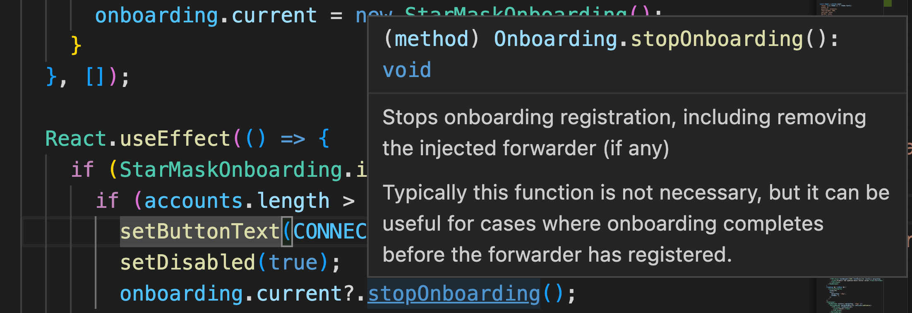

# 入门库

作为支持 Starcoin 的网站开发人员，将用户发送到异地安装 StarMask 会带来挑战。
最值得注意的是，您必须通知用户在安装后返回您的站点并刷新他们的浏览器。
只有在刷新之后，您的站点才会检测到用户新安装的 StarMask 扩展。
我们 StarMask 非常关心用户体验，我们知道这个工作流程需要改进。

StarMask 现在提供了一个 starmask 入门库，旨在改善和简化入门体验。
新库公开了一个 API 来启动入门流程。在此过程中，它将您的站点注册为入门请求的来源。
StarMask 将在用户完成入门流程后检查此来源。
如果找到来源，StarMask 入门流程的最终确认按钮将指示用户将被重定向回您的站点。

## 开始使用

1. 使用 npm 或 yarn 安装 `@starcoin/starmask-onboarding`。

2. 导入入门库或将其包含在您的页面中。

```javascript
// 作为一个 ES6 模块
import StarMaskOnboarding from "@starcoin/starmask-onboarding";
// 或者作为一个 ES5 模块
const StarMaskOnboarding = require("@starcoin/starmask-onboarding");
```

如果您愿意，可以改为包含库附带的预构建 ES5 包：

```html
<script src="./starmask-onboarding.bundle.js"></script>
```

3. 创建 Onboarding 库的新实例

```javascript
const onboarding = new StarMaskOnboarding();
```

4. 响应用户事件（例如，单击按钮）启动入门流程。

```javascript
onboarding.startOnboarding();
```

## 例子

### 基本用法

```javascript
const onboarding = new StarMaskOnboarding();
onboarding.startOnboarding();
```

### 使用 React

```jsx
import StarMaskOnboarding from "@starcoin/starmask-onboarding";
import React from "react";

const ONBOARD_TEXT = "Click here to install StarMask!";
const CONNECT_TEXT = "Connect";
const CONNECTED_TEXT = "Connected";

export function OnboardingButton() {
  const [buttonText, setButtonText] = React.useState(ONBOARD_TEXT);
  const [isDisabled, setDisabled] = React.useState(false);
  const [accounts, setAccounts] = React.useState([]);
  const onboarding = React.useRef();

  React.useEffect(() => {
    if (!onboarding.current) {
      onboarding.current = new StarMaskOnboarding();
    }
  }, []);

  React.useEffect(() => {
    if (StarMaskOnboarding.isStarMaskInstalled()) {
      if (accounts.length > 0) {
        setButtonText(CONNECTED_TEXT);
        setDisabled(true);
        onboarding.current?.stopOnboarding();
      } else {
        setButtonText(CONNECT_TEXT);
        setDisabled(false);
      }
    }
  }, [accounts]);

  React.useEffect(() => {
    function handleNewAccounts(newAccounts) {
      setAccounts(newAccounts);
    }
    if (StarMaskOnboarding.isStarMaskInstalled()) {
      window.starcoin
        .request({ method: "stc_requestAccounts" })
        .then(handleNewAccounts);
      window.starcoin.on("accountsChanged", handleNewAccounts);
      return () => {
        window.starcoin.off("accountsChanged", handleNewAccounts);
      };
    }
  }, []);

  const onClick = () => {
    if (StarMaskOnboarding.isStarMaskInstalled()) {
      window.starcoin
        .request({ method: "stc_requestAccounts" })
        .then((newAccounts) => setAccounts(newAccounts));
    } else {
      onboarding.current?.startOnboarding();
    }
  };
  return (
    <button disabled={isDisabled} onClick={onClick}>
      {buttonText}
    </button>
  );
}
```

### 使用 TypeScript

我们使用 `@starcoin/starmask-onboarding` 发布我们的 TypeScript 类型。
在使用 `onboarding` 库时修改上面的示例以获得类型安全很简单：

```jsx
  -const onboarding = React.useRef();
  +const onboarding = React.useRef<StarMaskOnboarding>();
```

执行此步骤将为您提供库公开的方法的编辑器自动完成功能，并提供有用的文档。



### 使用 Vanilla Javascript + HTML

```html
<!DOCTYPE html>
<html lang="en-CA">
  <head>
    <title>StarMask Onboarding Example</title>
    <meta charset="UTF-8" />
  </head>
  <body>
    <h1>Sample Dapp</h1>
    <button id="onboard">Loading...</button>
    <script src="./starmask-onboarding.bundle.js"></script>
    <script>
      window.addEventListener("DOMContentLoaded", () => {
        const onboarding = new StarMaskOnboarding();
        const onboardButton = document.getElementById("onboard");
        let accounts;

        const updateButton = () => {
          if (!StarMaskOnboarding.isStarMaskInstalled()) {
            onboardButton.innerText = "Click here to install StarMask!";
            onboardButton.onclick = () => {
              onboardButton.innerText = "Onboarding in progress";
              onboardButton.disabled = true;
              onboarding.startOnboarding();
            };
          } else if (accounts && accounts.length > 0) {
            onboardButton.innerText = "Connected";
            onboardButton.disabled = true;
            onboarding.stopOnboarding();
          } else {
            onboardButton.innerText = "Connect";
            onboardButton.onclick = async () => {
              await window.starcoin.request({
                method: "stc_requestAccounts",
              });
            };
          }
        };

        updateButton();
        if (StarMaskOnboarding.isStarMaskInstalled()) {
          window.starcoin.on("accountsChanged", (newAccounts) => {
            accounts = newAccounts;
            updateButton();
          });
        }
      });
    </script>
  </body>
</html>
```

## Onboarding Diagram

这是载入库、转发器和扩展程序之间的交互图：


