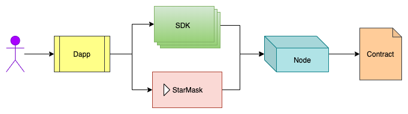
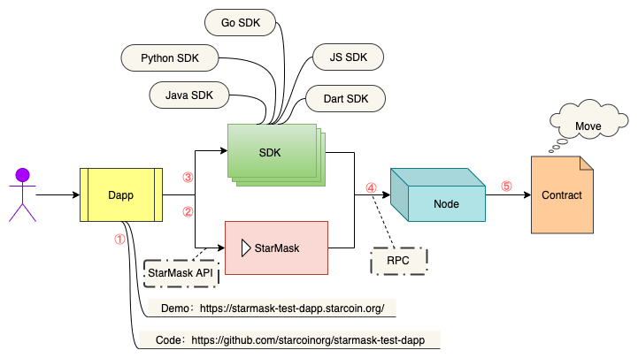

# Dapp 开发指南

本文档通过介绍 Dapp 的整体开发流程，讲解开发过程中涉及的相关知识以及工具链，帮助您基于 Starcoin 快速构建属于自己的 Dapp。

## 开发流程

任何公链的 Dapp，从前端页面开始，最终调用到链上部署的智能合约，都包含以下的主要环节：

这里以 Starcoin 为例进行讲解，上图涉及到的主要组件有：

1. 交互入口页面；
2. 跟链节点通讯的 SDK；
3. 也可能通过浏览器插件钱包 StarMask 跟链的节点通讯（实际上，StarMask 也是调用了 JS 的 SDK）；
4. 启动链的节点；
5. 链上部署的合约；

上面提到的每一步都涉及到相关的知识和可用的工具，如下图所示：

这里按从左到右的顺序，先简单介绍一下开发者比较关心的内容（后面会展开介绍）：

1. 入门 Dapp：适合想快速了解和体验 Dapp，或者想开发 Dapp 页面的前端开发者；
2. StarMask API：Dapp 开发中经常会遇到签名等场景，需要调用浏览器插件钱包 StarMask 的 API，与钱包进行交互，完成用户操作以及常见的链交互；
3. SDK：SDK 是跟链交互的另一种常用方式，Starcoin 包含多语言版本的 SDK，开发者可以根据自己的需求选择对应版本的 SDK：
   1. JS SDK
   2. Java SDK
   3. Python SDK
   4. Go SDK
   5. Dart SDK
4. Starcoin 节点 RPC 接口：包含了 Starcoin 节点对外的所有服务和对应接口，开发者或者 SDK 可以通过这些接口跟链进行交互；
5. Move 智能合约：开发者通过 Move 语言将逻辑表达出来并部署到 Starcoin 链上，供所有的用户调用；

以上是基于 Starcoin 开发 Dapp 可能涉及的主要环节和内容的简单介绍，下面将进一步对每一个环节展开来介绍。如果您只对其中的某一部分或者某一个环节感兴趣，可以直接跳转到对应的内容。

## 入门 Dapp

这是一个简单的入门 Dapp，也是用户真正能够使用和感受 Dapp 的产品入口。您可以通过它快速地了解什么是 Dapp，感受 Dapp 如何跟链进行交互。如果您是开发人员，还可以通过查看它的源代码，了解一个简单的 Dapp 的代码结构，快速上手构建属于自己的 Dapp。

- 体验入口：https://starmask-test-dapp.starcoin.org/

- 代码仓库：https://github.com/starcoinorg/starmask-test-dapp

## StarMask

StarMask 是 Starcoin 官方发布的浏览器插件钱包，不仅是用户管理链上数字资产的一种方式，也是 Dapp 跟链上进行交互的一种选择。例如，用户对 Dapp 的交易进行签名，并将签名后的交易提交到远程节点的 Txpool 中。这里带您深入了解一下 StarMask：

- 安装指南：https://github.com/starcoinorg/starmask-extension/blob/main/docs/zh/how-to-install.md

- 使用指南：https://github.com/starcoinorg/starmask-extension/blob/main/docs/zh/how-to-use.md

## SDK

跟链交互，除了 StarMask 这种方式，还可以选择 SDK 的方式。Starcoin 官方提供了多个语言版本的 SDK，以方便开发者通过编程的方式跟 Starcoin 节点进行交互。以下是 Starcoin 支持的 SDK：

1. JS SDK

   - 开发者文档：https://starcoin.org/zh/developer/sdk/javascript/
   - 源代码：https://github.com/starcoinorg/starcoin.js

2. Java SDK

   - 开发者文档：https://github.com/starcoinorg/starcoin-java#readme
   - 源代码：https://github.com/starcoinorg/starcoin-java

3. Python SDK

   - 开发者文档：https://starcoin-sdk-python.readthedocs.io
   - 源代码：https://github.com/starcoinorg/starcoin-sdk-python

4. Go SDK

   - 开发者文档：https://github.com/starcoinorg/starcoin-go/blob/main/README.md
   - 源代码：https://github.com/starcoinorg/starcoin-go

5. Dart SDK

   - 源代码：https://github.com/starcoinorg/starcoin.dart

## Starcoin 节点&RPC 接口

在 Dapp 的整个生命周期中，不管是使用 StarMask 还是使用 SDK 跟链交互，最终都是在跟分布式网络里面的一个 Starcoin 节点通信。所以，一个稳定的 Starcoin 节点是 Dapp 交易能够打包上链的必要条件。Starcoin 节点对链下环境提供了统一必要的接口，这里深入介绍一下 Starcoin 节点：

1. 选择网络

   Starcoin 根据目标的不同，设计了多个不同的网络，覆盖了开发周期的每个阶段。包括 Dev、Test、Halley、Proxima、Barnard、Main：

   - Dev：用于本地开发
   - Test：用于单元测试和集成测试
   - Halley：总是运行 Stdlib 的 latest 版本，如果 Stdlib 变更则会立刻重置 Genesis Block， 清理原来的数据
   - Proxima：用于 Dapp 上线前测试，会定期清数据
   - Barnard：用于 Dapp 上线前测试，不删除数据，必须兼容性升级
   - Main：Starcoin 主网

   在启动 Starcoin 节点前，建议先根据自己的需求，选择不同的网络。

2. 节点安装

   Starcoin 有多种安装方式（[查看详情](https://starcoin.org/zh/developer/setup/install/)）

   - 根据不同的平台，下载对应的二进制，Starcoin 同时支持 Windows、Mac 和 Linux。[下载链接](https://github.com/starcoinorg/starcoin/releases)
   - 源代码编译成二进制，[操作指南](https://starcoin.org/zh/developer/setup/build/)
   - 通过 Docker 安装，[操作指南](https://starcoin.org/zh/developer/setup/run_by_docker/)

3. 运行节点

   根据前面「节点安装」的不同，节点运行方式也稍微有点区别

   - Docker 运行，[操作指南](https://starcoin.org/zh/developer/setup/run_by_docker/)
   - 二进制运行，[操作指南](https://starcoin.org/zh/developer/setup/runnetwork/)

   不管是通过哪种方式运行，需要修改-n 参数选择符合自己需求的网络。

4. 控制台

   Starcoin 节点运行过程中，经常需要通过控制台连接上节点，以命令行的形式查看运行状态。Starcoin 提供了 console 命令用于连接节点，[操作指南](https://starcoin.org/zh/developer/cli/console/)

5. 命令行操作文档

   Starcoin 支持了丰富的命令，常用的命令如下：

   - account：账号相关的命令
   - chain：链相关的命令
   - node：节点相关的命令
   - state：状态相关的命令

   还有很多其他的命令，查看[更多详情](https://starcoin.org/zh/developer/cli/)

6. RPC 协议

   前面介绍了跟节点相关的信息，重点介绍了通过控制台的方式访问 Starcoin 节点。实际上，还可以通过 RPC 接口的形式来访问 Starcoin 节点。可以说，这是通过编程来访问节点的最佳方式，SDK 正是通过这些 RPC 接口跟节点进行交互。这里是详细的[RPC 协议文档](https://starcoin.org/zh/developer/rpc/rpc_document/)，开发者在必要的时候，可以查看 RPC 详情进行编程。

7. 运行原理

   如果您是开发者，想进一步了解 Starcoin 的原理，可以从以下方面入手：

   - 关键概念：https://starcoin.org/zh/developer/key_concepts/
   <!-- - SIPs：https://starcoin.org/zh/developer/sips/ -->
   - 源代码：https://github.com/starcoinorg/starcoin

## Move

Starcoin 是第一个支持 Move 智能合约的无许可公链。

在区块链的场景下，开源是常态。相比过去中心化场景，对智能合约开发者来说，既要实现业务，又要兼顾安全，无疑是一个非常大的挑战。而 DeFi 等场景的安全，又显得尤为重要。正是基于这些考虑，智能合约语言 Move 把安全当成首要设计目标，从语言层面对金融场景进行安全加固，开箱即用，极大程度地降低智能合约开发者的门槛。可以说，Move 是目前唯一不影响货币功能的智能合约。

Move 语法简单，安全特性开箱即用，能够做到轻松上手。对于想要编写 Move 合约的开发者，Starcoin 准备了非常丰富的开发教程，完善的开发工具。

1. Move 教程：

- 《[Move book](https://move-book.com/cn/index.html)》中文版
- Move 基础篇：https://weibo.com/l/wblive/p/show/1022:2321324653445776015474
- Move 进阶篇：https://weibo.com/l/wblive/p/show/1022:2321324655638159687840
- Move & Dapp 实战：https://weibo.com/l/wblive/p/show/1022:2321324658455788257683
- Move 开发实战：https://weibo.com/l/wblive/p/show/1022:2321324661355444568427
- Move 语言设计思路：https://weibo.com/l/wblive/p/show/1022:2321324661515499208925
- Move & DeFi 开发：https://weibo.com/tv/show/1042211:4664043403935862
- Move & DeFi 安全：https://weibo.com/tv/show/1042211:4672003286958120
- Move 为 DeFi 而生：https://learnblockchain.cn/article/2636
- Move 中文社区 ：https://www.movelang.io/

2. IDE：

- Starcoin IDE：https://marketplace.visualstudio.com/items?itemName=starcoinorg.starcoin-ide
- Move-Package-Manager：这是一个非常轻量级的测试、发布 Move 合约的工具，[下载链接和操作指南](https://github.com/starcoinorg/guide-to-move-package-manager)

3. 测试

   Move 支持多种测试方案

   <!-- - Unit Test：[指南](https://github.com/diem/diem/blob/main/language/changes/4-unit-testing.md) -->
   - Speck Test：语法跟 UT 差不多，主要区别是 ST 会预先初始化链
     - [使用指南](https://github.com/starcoinorg/guide-to-move-package-manager/)
     <!-- - [参考例子](https://github.com/starcoinorg/starcoin-framework/tree/main/spectests) -->

4. 编译&部署

   合约完成之后，需要编译并部署到 Starcoin 的链上。部署合约也有多种方式：

   - 控制台：[操作指南](https://starcoin.org/en/developer/tutorials/deploy_move_contract/)
   - starmask-test-dapp：Contract blob hex 功能，[操作入口](https://starmask-test-dapp.starcoin.org/)
   - Move-Package-Manager：[move package manager 指南](https://github.com/starcoinorg/guide-to-move-package-manager)

   这里需要注意的是，选择合适的网络进行部署。

5. Move[入门例子](https://starcoin.org/zh/developer/move/example/)

## Stdlib & 协议

Starcoin 有 Stdlib 特性，完全使用 Move 语言开发，感兴趣的朋友可以[查看源代码]
<!-- (https://github.com/starcoinorg/starcoin/tree/master/vm/stdlib/modules)。 -->

Starcoin 在 Stdlib 中定义了多种常用协议，如下图所示（更多协议在陆续制定中）：

1. DAO 协议

   DAO 协议是 Stdlib 中一个基础的协议，通过 DAO 协议能够很好的进行链上治理。这里是通过[链上治理进行代码升级](https://starcoin.org/zh/developer/blog/starcoin_stdlib_upgrade)的例子。

2. NFT 协议

   - [协议介绍](https://starcoin.org/zh/developer/protocols/starcoin_nft/)
   - [SIP22](https://github.com/starcoinorg/sips/blob/master/sip-22/index.zh.md)
   - 源代码
     - https://github.com/starcoinorg/starcoin-framework/tree/main/sources/NFT.move
     - https://github.com/starcoinorg/starcoin-framework/tree/main/sources/MerkleNFT.move

3. Stdlib[使用指南](https://starcoin.org/zh/developer/stdlib/stdlib/)

## 其他开发者工具

1. 官网

   Starcoin 的[官网](https://starcoin.org/zh/)。通过官网能获取到非常多的信息，比如白皮书、开发者、工具链、Starcoin 最新动态等等。

2. 水龙头

   在测试过程中免不了需要测试网的 STC，比如支付 gas。开发者可以通过 Starcoin 提供的不同网络（暂时只开放 Barnad）的水龙头申请 STC：

   - Barnard：https://faucet.starcoin.org
   <!-- - Barnard：https://faucet.starcoin.org/barnard -->

3. 浏览器

   浏览器也是常用的开发者工具，是链的一个补充。Starcoin 常用的浏览器是[stcscan](https://stcscan.io/)。

4. 投票 Dapp

   投票 Dapp 也是常用的开发者工具，是 Starcoin 链上治理的入口。开发者可以通过这个 Dapp 发起自己的提案，社区会进行通过这个 Dapp 进行公开、公平、公正地投票，只有投票通过才能在链上执行。

5. Starcoin logos && icons

   <!-- 下载地址: https://starcoin.org/downloads/logo.zip -->
