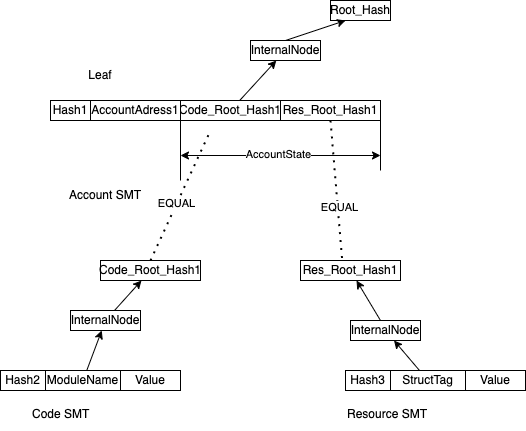

# 状态

需要先理解 [smt](05-smt.md) 的原理。

##状态的实现

在 Starcoin 中，区块 ( `Block` ) 由一些交易 （ `Transaction` ) 组成，对一个区块的执行就是对区块内交易的执行。
交易执行的结果由状态表示。这里采用的全局状态，包含链上所有账户的最新状态和历史状态。
状态实际上就是账号地址 ( `AccountAddress` ) 到账户状态 ( `AccountState` ) 的映射。
Starcoin 中状态是一颗2层的 SMT 树，如下图所示。



状态是 `AccountAddress` 到 `AccountState` 的映射，随着新的 `Block` 的执行 ， `AccountState` 会变化，由于需要保留历史状态相关的证明，这里使用了 SMT 这一数据结构。
为了方便这里把 `AccountAddress` 到 `AccountState` 的状态称为 `Account SMT`。这里 `(AccountAddress, AccountState)` 存储在 `Account SMT` 的 `Leaf` 节点上。
在图中就是 `Account SMT` 的根节点是 `Root_Hash`，这里对应 `BlockHeader` 中的 `state_root`。
在 Starcoin 中 `AccountAddress` 不同于以太坊个人账户和合约账户是分开的，合约是部署在个人账户下。`AccountState` 被分为两部分，分别是合约代码 ( Code ) 和 资源 ( Resource)。
Code 就是账号下合约代码， Resource 就是你有哪些 Token (比如 STC )。
新 `Block` 执行， Code 状态和 Resource 状态都可能会改变。
这样 Code 状态用了一颗 SMT 记为 `Code SMT`, Resource 状态用了一棵 SMT 记为 `Resource SMT`。
`AccountState` 状态分为 `Code SMT` 和 `Rescoure SMT`，这样每次执行新 `Block` 后，先存储 `Code SMT` 和 `Resource SMT`， `AccountState` 只用存储 `Code SMT` 和 `Resource SMT` 的根节点。
在图中分别为 `Code_Root_Hash1` 和 `Res_Root_Hash1`。
当然这应该是一个事务的过程。

## 状态在 Starcoin 中对应代码

在 Starcoin 中 `Account SMT` 定义为`ChainStateDB`
```rust
pub struct ChainStateDB {
    store: Arc<dyn StateNodeStore>,
    ///global state tree.
    state_tree: StateTree<AccountAddress>,
}

pub struct StateTree<K: RawKey> {
    storage: Arc<dyn StateNodeStore>,
    storage_root_hash: RwLock<HashValue>,
}

pub enum DataType {
    CODE,
    RESOURCE,
}

pub struct AccountState {
    storage_roots: Vec<Option<HashValue>>,
}

struct AccountStateObject {
    code_tree: Mutex<Option<StateTree<ModuleName>>>,
    resource_tree: Mutex<StateTree<StructTag>>,
    store: Arc<dyn StateNodeStore>,
}
```
这里 `store` 对应存储的 `KvStore`， `ChainStateDB` 的 `state_tree` 代表 `AccountAddreee` -> `AccountState`对应的 `SMT` 树。
这里 `StateTree` 成员 `storage_root_hash` 是一个 `HashValue` 对应 `SMT` 中的根节点。
`AccountState` 有2个 `HashValue` 元素，对应图中 `Code_Root_Hash1` 和 `Res_Root_Hash1`，也是 `AccountStateObject` 中的 `code_tree` 和 `resource_tree` 的根节点。
Starcoin 中状态是一个2级的 SMT 结构，`ChainStateDB` 对应一级， `AccountStateObject` 对应二级。


### 解释 API

### 解释 update, commit , flush, dump 介绍


### StateView 相关


首先看下状态定义
```rust
pub struct AccountStateSet(Vec<Option<StateSet>>);

pub struct StateSet(Vec<(Vec<u8>, Vec<u8>)>);
```

还有AccountStateSet

get_proof_with

StateProof为什么这么定义
ChainStateReader

StateView相关

AccessPath如何定义

幂等性相关