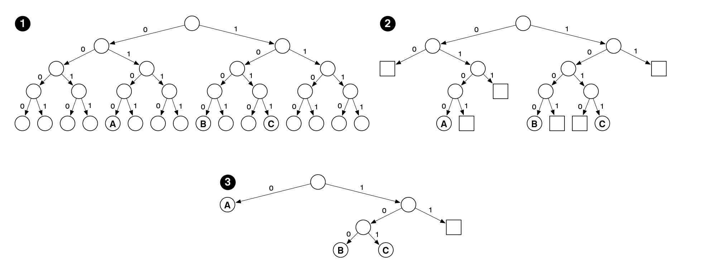
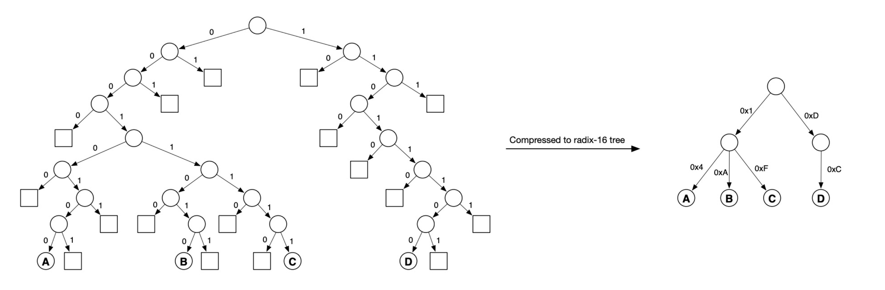
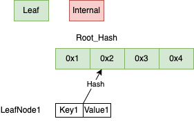
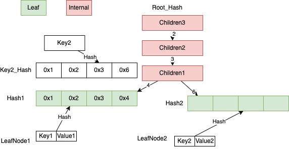
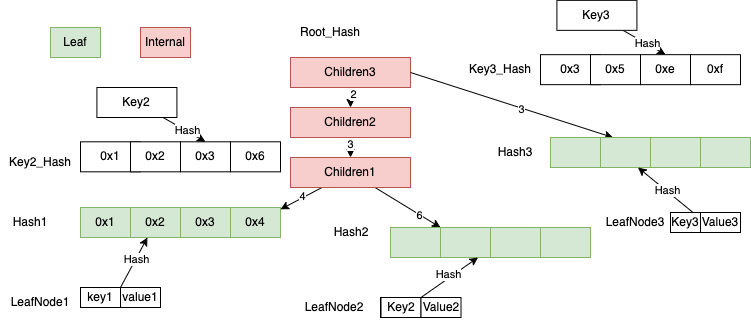
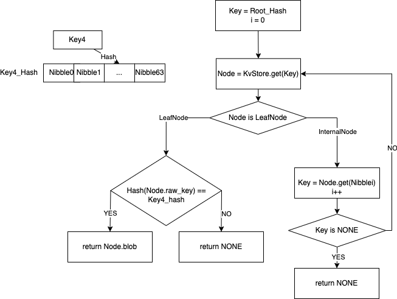

# Sparse Merkle Tree

要了解为什么用Sparse Merkle Tree (下面简称 SMT )，先需要了解下 [Merkle Tree](00-merkletree.md)

## SMT

### 介绍下为啥需要用SMT

Starcoin 是基于账户模型，不同于以太坊个人账户和合约账户是分开的， Starcoin 中合约相关信息也都存储在 State 中。
State 包括合约代码( CODE )和资源( RESOURCE )，余额相关信息都在RESOURCE中，需要数据结构来处理账户地址到状态的映射，
也就是 AccountAddree -> State， 直观上来这个映射就是 Key -> Value 之间映射。
处理这个可以使用 HashMap，系统中维护一个全局的 HashMap，每次有新的账户创建就插入一对 Key， Value，
查询账户余额就在 HashMap 中使用 Key 来查询，
不考虑 Hash 碰撞，查询基本是常数时间完成(O(1))，更新也是，
这种设计最大问题是不能提供 Merkle Proof， 比如证明某个时间点这个账户余额大于多少( StateProof )。
一种想法是基于当时的 HashMap 构建 Merkle Tree，
基于这种想法，每次有新的区块发布的需要基于 HashMap 构建新的 Merkle Tree，
并将 Merkle Tree 对应的 Root_Hash 发布到 BlockHeader 中，
这个方案是有问题的，HashMap 效率很高，但是每次构建 Merkle Tree 效率很低。
还有一种想法是我们不用 HashMap，直接构建 Merkle Tree 把所有账户的状态都存下来，
这个方法的问题在于 Merkle Tree 没有提供高效查找和修改的方法。
这里使用了一种基于压缩 Trie 数据结构 Jellyfish-Merkle-Tree (JMT)

### SMT设计原理

#### Merkle Tree 到SMT

在 Starcoin 中 Hash 的计算都是基于 sha3_256 ( Hash Struct 会加入 prefix 文末会给出示例代码) 计算来的， 所以这颗树是2的256次方个元素
下图显示了 Merkle Tree到 SMT的两个优化

图1是一个 Merkle Tree，图2优化将空子树用 PlaceHolder (方格)代替， 节省了空间，
图3优化将只含有一个叶子节点的子树设置成节点， 这样减少了 Proof 时对 Hash 的计算。
这里 A 的2进制路径表示为0100， B 的为1000， C 的为1011

#### 基数树前缀压缩

下图显示了基于压缩的优化

这里图中的 Merkle Tree 的Key的长度都是8个bit，有很多空节点，很稀疏，可以进行压缩优化。
A 的2进制路径为00010100，每4个 bit 压缩后变成0x14，
B 的2进制路径为00011010，压缩后为0x1A，
C 的2进制路径为00011111，压缩后为0x1F，
D 的2进制路径为11101100，压缩后为0xDC，
这里每4个 bit 压缩叫做一个 Nibble，
Merkle Tree 可以认为是基数等于2的基数树，图中右边可以认为是基数等于16的基数树，
SMT 就是基于基数16的基数树(这里简称为 Radix16)，这个设计的优点就是降低树的高度，减少内存访问次数，降低内存，
这种 Radix Tree 目前有些优化手段比如 ADAPTIVE RADIX TREE (Starcoin中固定为 node16)， 论文(https://db.in.tum.de/~leis/papers/ART.pdf) 有更多内容，
还有其他一些 Radix Tree 优化思路，比如以太坊使用的是改进版本的 Patricia Radix Tree (https://eth.wiki/fundamentals/patricia-tree)，
还有 HAT RADIX TREE， 这些这里不介绍

### SMT 数据结构和操作

上面提到SMT实际上是一个Radix16 Trie， 在 Starcoin 中每个 SMT 中 Key 的长度是256 bit，这里基于4个 bit (一个 Nibble )做了压缩,对于任意一个输入，我们计算sha3_256后进行处理，
这样整个树的高度就变为64。
SMT 的节点类型分为 Null， InternalNode， LeafNode，
Null 就是前面提到的 PlaceHolder(方格)， InternalNode 最多有16个子节点( InternalNode 对应一个 HashMap， 子节点索引为为0-16，子节点类型是 InternalNode 或者 LeafNode )， LeafNode 存储的是实际的 Key， Value 的键值对。
区块链中需要保存历史状态，这里如何查询某个 Key 的历史状态，之前提到 Merkle Tree 里保存 Root_Hash 就认为是保存了整棵树，
需要提供树的根节点值( Root_Hash )和查询的 Key ，这个根节点就是在 Starcoin 中 BlockHeader 中的 state_root ， 这也是后续讲到 StateTree 的构建需要用到 state_root。
Starcoin 中 SMT 需要持久化到 KvStore ， 这里用的是 RocksDB (测试中 MockTreeStore 使用的是 HashMap + BTreeSet)，
为了将整个 SMT 保存在 KvStore 中，SMT 的所有节点都只存储 Hash 值(对应的内容通过 KvStore 保存和查询)，存储时需要将 Null， InternalNode， LeafNode 节点序列化存储在 KvStore 中。
例如查找 Key 为 Hello 对应的 Value， 在 SMT 中计算 `Key_Hash = sha3_256("Hello")`， 操作都是对 Key_Hash 进行。

这里说明下 SMT 中各种节点
```rust
pub struct Child {
    // The hash value of this child node.
    pub hash: HashValue,
    // Whether the child is a leaf node.
    pub is_leaf: bool,
}
pub type Children = HashMap<Nibble, Child>;

pub struct InternalNode {
    // Up to 16 Children.
    Children: Children,
    //Node's hash cache
    cached_hash: Cell<Option<HashValue>>,
}

pub trait RawKey: Clone + Ord {
    /// Raw key's hash, will used as tree's nibble path
    /// Directly use origin byte's sha3_256 hash, do not use CryptoHash to add salt.
    fn key_hash(&self) -> HashValue {
        HashValue::sha3_256_of(
            self.encode_key()
                .expect("Serialize key failed when hash.")
                .as_slice(),
        )
    }

    /// Encode the raw key, the raw key's bytes will store to leaf node.
    fn encode_key(&self) -> Result<Vec<u8>>;

    fn decode_key(bytes: &[u8]) -> Result<Self>;
}

pub struct LeafNode<K: RawKey> {
    /// The origin key associated with this leaf node's Blob.
    #[serde(
    deserialize_with = "deserialize_raw_key",
    serialize_with = "serialize_raw_key"
    )]
    raw_key: K,
    /// The hash of the blob.
    blob_hash: HashValue,
    /// The blob associated with `raw_key`.
    blob: Blob,
    #[serde(skip)]
    cached_hash: Cell<Option<HashValue>>,
}
```
Child 的定义可以看到只存储了 Hash 值，Value 通过 `KvStore.get(Hash)`  获取， 然后再反序列化确定是 InternalNode 还是 LeafNode。

下面说明下各个操作流程
## 在空树种创建 LeafNode 例子

我们在一颗空树种插入 Key "Hello"， Value "World"，
基于这个产生一个叶子节点和叶子节点的 Hash 值，这个 Hash 值就是 SMT 新的根节点，
Hash 值和 LeafNode 序列化后插入到 KvStore 中。图中说明了这点


## 插入流程

在 Starcoin 中 Hash 值是256 bit， 画图不方便，这里用短点地址16 bit做例子

### 空树插入叶子

开始为空 SMT,插入一个 Key1， Value1， 生成的 LeafNode1 的 Hash1 为0x1234，
这个是新的根节点， 如下图




### 新插入叶子节点和某个叶子节点有公共前缀

在上面基础下新插入 Key2， Value2， 需要查找 Key2 插入的位置， 先计算 Key2 的 `Key2_Hash = Hash(Key2)`，
假设 Key2_Hash 值为0x1236，  Key2_Hash 和 Root_Hash1 有公共前缀0x123， 先由 Key2， Value2 生成一个 LeafNode2，
由于 LeafNode1 的 Hash 值和 Key2_Hash 有公共前缀0x123，需要生成一个 InternalNode,记为 Children1，其中 `Children1[4] = Hash(LeafNode1)， Children1[6] = Hash(LeafNode2)`。
公共前缀0x12， 0x1也需要生成 InternalNode。这里先构造0x12的 InternalNode 记为 Children2， `Children2[3] = Hash(Children1)`，
然后构造0x1的 InternalNode 记为 Children3， `Children3[2]= Hash(Children2)`。
LeafNode2，Children1，Children2， Children3 按照 Hash 和序列化后的键值对写入到 KvStore，
新生成的根节点是 Hash(Children3)。



### 新插入叶子结点和某个内部节点有公共前缀

#### 内部节点插入新子节点

在上面基础上，假定插入 Key3，Value3，
假定插入 Key3 的 Hash 值 Key3_Hash 为0x35ef， Children3 的索引3的子节点为空， 将 Key3， Value3 生成新的叶子节点 LeafNode3，
`Children3[3] = Hash(LeafNode3)`。
将 LeafNode3，Children3 按照 Hash 和序列化后键值对写入到 KvStore， 新生成的根节点是 Hash(Children3)。
如下面这图



#### 内部节点更新子节点

假定插入 Key3_Hash 值为0x25ef，Children3 的索引2的子节点为 Children2，递归处理在 Children2 插入，
更新 Children2， 更新`Children3[2] = Hash(Children2)`，
将 Children2， Children3 按照 Hash 和序列化值写入到 KvStore，新生成的根节点是 Hash(Children3)。
如下面这图，这种情况对应当前 InternalNode 修改已存在的子节点，需要递归处理


## 查询流程

在上面流程基础上，假设要查询的 Key4，先计算 Key4 的 `Key4_Hash = Hash(key4)`， 在 Starcoin 中 Key4_Hash 是个256 bit 的值，也就是64个 Nibble (一个 Nibble 为4bit)， 记为`Nibble0..Nibble63`。
查找先从根节点 Root_Hash 获取根节点对应 Node ，查看 Node 是 LeafNode 还是 InternalNode，
[1]如果是 LeafNode，查看下 LeafNode 对应的 Key 的 Hash 值是否和 Key4_Hash 相等，相等就返回结果， 不相等返回 None
[2]如果是 IntenalNode 查找 InternalNode 对应 Nibblei 的子节点(初始`i = 0`，每次`i = i + 1`)，查找到新 Node 是 LeafNode，走条件[1]， 否则跳转到[2]
流程图在下面图中，代码在 Starcoin 中对应 get_proof_with



## SMT API 相关说明

### new

```rust
pub fn new(TreeReader: &'a) -> Self {
    
}
```
这里 TreeReader 是一个 trait (可以认为是类似 Java 中 inteface )， 在 Starcoin 中是提供 Key Value 操作的数据结构，
在 Starcoin 中对应的 KvStore 是 RocksDB， MockTreeStore 中使是 HashMap + BTeeSet，
有 TreeReader 就有 TreeWriter，这里 TreeReader 对应的是 SMT 的查找和在内存中的计算， TreeWriter 对应的是持久化到 KvStore 操作，
Starcoin 持久层并没有实现 TreeWriter trait，现在直接写 KvStore(这部分需要结合 代码中StateDB 的 flush 来理解)， Mock 操作的 MockTreeStore 使用了 TreeWriter。
可以简单认为 SMT 是内存中一颗 Trie 树，持久化在 RocksDB 上。

### updates

```rust
pub fn updates(&self,
    state_root_hash: Option<HashValue>,
    blob_set: Vec<(KEY, Vec<u8>)>
    ) -> Result<(HashValue, TreeUpdateBatch<KEY>)>;

pub struct StaleNodeIndex {
    pub stale_since_version: HashValue,
    pub node_key: HashValue,
}

pub struct TreeUpdateBatch<KEY> {
    pub node_batch: BTreeMap<HashValue, Node<KEY>>,
    pub stale_node_index_batch: BTreeSet<StaleNodeIndex>,
    pub num_new_leaves: usize,
    pub num_stale_leaves: usize,
}
```
这里 HashValue 就是之前提到的 sha3_256 的计算值，
这里说明下各个参数，
state_root_hash 是某个 SMT 树的根节点 Hash 值，通过 Hash 值唯一确定了这颗 SMT，
blob_set 是 Key，Value 列表，
这么设计是为了一个 Block 执行交易后满足幂等性 这里 state_root_hash 等于前一个 BlockHeader 中的 state_root ( SMT 的 Root_Hash 值)，
返回值`Result<(HashValue, TreeUpdateBatch<KEY>)>` HashValue 代表新的 SMT 的 Hash 值， 这个新的 HashValue 存储在 BlockHeader 中的 state_root，
返回值中 TreeUpdateBatch 里面的 node_batch， 这里比如我们 blob_set 是`[(Key1, Value1), (Key2, Value2]`，
SMT 会产生 LeafNode 和 InternalNode，会把这些按照Hash值和自身存到 BTreeMap 中，
StaleNodeIndex 中 stale_since_version 是这次新产生的根节点 Hash， node_key 是被修改过的 Node 的 Hash。

### get_proof_with

```rust
pub fn get_with_proof(&self, key: &K) -> Result<(Option<Vec<u8>>, SparseMerkleProof)>
```
获取 Key 对应的 Value 的值，如果存在并返回对应的 Merkle Proof 证明。
[proof](07-proof.md) 待补充。

### Starcoin 中 sha3_256  Struct 示例代码
```rust
let buf = hex::decode(
"0xfa000000000000007b161ceeef010000000000000000000000000000000000000000000000000000"
.strip_prefix("0x").unwrap()
).unwrap();
let blob = Blob::from(buf);
let salt_prefix: &[u8] = b"STARCOIN::Blob";
let ser = bcs::to_bytes(&blob)?;
let salt = [
HashValue::sha3_256_of(salt_prefix).as_slice(),
ser.as_slice(),
]
.concat();
let hash = HashValue::sha3_256_of(&salt[..]);
```

### 参考文档

https://developers.diem.com/papers/jellyfish-merkle-tree/2021-01-14.pdf

https://westar.io/blog/jellyfish-merkle-tree-in-libra/

### 相关资源

[draw.io](../../../../../static/smt.drawio)
