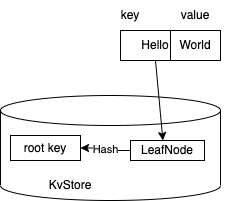
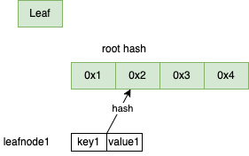
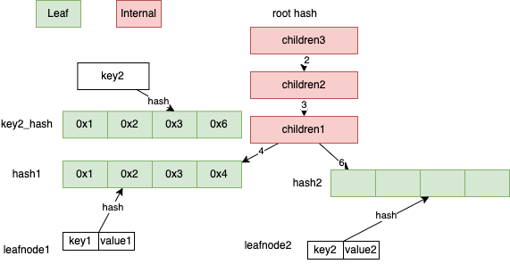
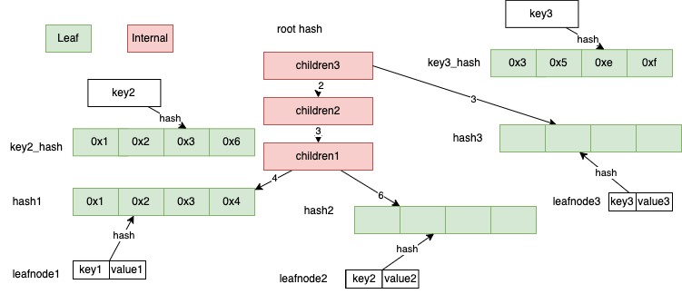
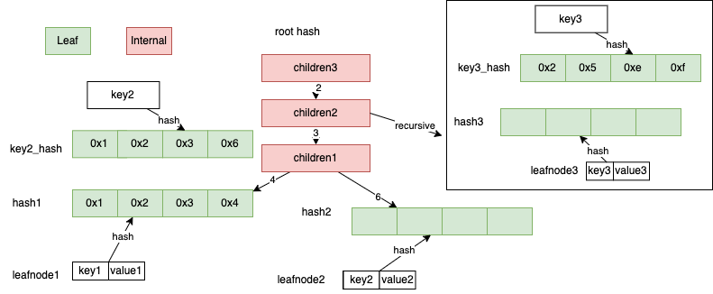
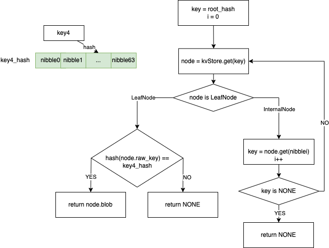

--- 
sidebar_position: 2
---

# Sparse Merkle Tree

要了解为什么用Sparse Merkle Tree(下面简称SMT)，先介绍下Merkle Tree

## Merkle Tree
Merkle Tree又被称为二叉哈希树，主要用在文件系统或者P2P系统中

下面这个图说明下


这里有A, B, C, D四个交易这个虚线框内，在Merkle Tree属于data blocks， 这部分叫做leaf node,

上面的虚线框属于hash pointer,

Hash 1的值是交易A的hash值和交易B的hash值拼接后计算的hash值(也可以有其他算法)，在图中是H(A) H(B) hash(1) = hash(H(A) + H(B)) 这里 + 表示字符串拼接

Hash 2的值是交易C和交易D的hash值拼接后计算的hash值，在图中是H(C) H(D) hash(2) = hash(H(C) + H(D))

Hash 3是Hash 1和Hash 2拼接计算的hash值，在图中是H(AB) H(CD), hash(3) = hash(hash(1) + hash(2)),  Hash 3也叫做root_hash

Merkle Tree有以下作用

### 快速定位修改
如果交易A被修改后，Hash 1也会被修改,root_hash也会被修改，所以可以认为记住root_hash就记住了整个Merkle Tree

### 校验交易
这个树的作用可以检验交易是否有效

在区块链light node不会记录所有交易数据，只会记录Merkle Tree的root_hash值

如果校验交易A是否存在, 这时候是把交易A的hash值这里记为H(A)发送给校验放, 校验方发送一个hash值列表[Hash(B), Hash(CD)]

如果保存的root_hash和hash(hash(H(A) + H(B)) + Hash(CD))相等, 证明交易A是存在的

这个过程叫做Merkle Proof


不同于以太坊个人账户和合约账户是分开的, starcoin中合约中

不同于以太坊外部账号和合约账号是分开的，在starcoin中合约相关都在账号(AccountAddress)对应的状态里面(State)

在合约中包含代码(code)和存储(storage), 这里有点类似C程序中的代码段和数据段

## SMT
### 介绍下为啥需要用SMT

starcoin是基于账户模型，不同于以太坊个人账户和合约账户是分开的, starcoin中合约相关信息也都存储在State中， State包括合约代码(CODE)和存储(RESOURCE)

余额相关信息都在RESOURCE中

需要数据结构来处理账户地址到账户状态的映射，也就是AccountAddree -> State

starcoin中账户地址(AccountAddress) 是128 bit(16个字节), 也就是32个16进制的数(一个16进制的数是4 bit)

直观上来这个映射就是key -> value之间映射，处理这个可以使用HashMap

系统中维护一个全局的HashMap,每次有新的账户创建就插入一对key, value

需要查询账户余额就在HashMap中使用key来查询

不考虑hash碰撞，查询基本是常数时间完成(O(1)),更新也是如此

这种设计最大问题是不能提供Merkel Proof, 比如证明某个时间点这个账户余额大于多少(StateProof)

一种想法是基于当时的HashMap构建Merkel Tree

基于这种想法，每次有新的区块发布的需要基于HashMap构建新的Merkel Tree并将Merkel Tree对应的root_hash发布到BlockHeader中

这个方案是有问题的，HashMap效率很高，但是每次构建Merkel Tree效率很低

还有一种想法是我们不用HashMap，直接构建Merkel Tree把所有账户的状态都存下来

这个方法的问题在于Merkel Tree没有提供高效查找和修改的方法

这里使用了一种基于压缩trie数据结构jellyfish-merkle-tree (JMT)

### SMT设计原理

#### Merkle Tree到SMT

在starcoin中Hash的计算都是基于sha3-256计算来的, 所以这颗树是2的256次方个元素

下图显示了Merkle Tree到SMT的两个优化

这里1显示了Merkel Tree形状，图2对其做了优化将空子树用placeholder(方格)代替, 节省了空间

图3优化将只含有一个叶子节点的子树设置成节点， 这样减少了proof时候对hash的计算

这里A的2进制路径表示为0100, B的为1000， C的为1011

#### 基数树前缀压缩

下图显示了基于压缩的优化

这里图中的Merkle Tree的key的长度都是8个bit，是颗稀疏，有很多空节点

A的2进制路径为00010100， 每4个bit压缩后变成右边的0x14

B的2进制路径为00011010, 压缩后为0x1A

C的2进制路径为00011111, 压缩后为0x1F

D的2进制路径为11101100，压缩后为0xDC

这里每4个bit压缩叫做一个nibble

Merkle Tree可以认为是基数等于2的基数树，图中右边可以认为是基数等于16的基数树

SMT就是基于基数16的基数树(这里简称为Radix16),这个设计的优点就是降低树的高度,减少内存访问次数,降低内存

这种Radix Tree叫做ADAPTIVE RADIX TREE(starcoin中固定为node16), 论文(https://db.in.tum.de/~leis/papers/ART.pdf) 有更多内容这里不介绍

还有其他一些Radix Tree优化思路，比如以太坊使用的是改进版本的Patricia Radix Tree(https://eth.wiki/fundamentals/patricia-tree), 比如HAT RADIX TREE， 这些这里不介绍

### SMT数据结构和操作
上面提到SMT实际上是一个Radix16 Trie, 在starcoin中每个key的长度是256bit, 这里基于4个bit(一个nibble)做了压缩,

这样整个树的高度就变为64

SMT的节点类型分为Null, Internal, Leaf

Null就是前面提到的placeholder, Internal最多有16个子节点(子节点类型可以是Internal或者Leaf， 这里对应一个HashMap, key为0-16)， Leaf存储的是实际的key, value

区块链中需要保存历史状态，这里如何查询某个key的历史状态，之前提到Merkle Tree里保存root_hash就认为是保存了整棵树,查询中需要历史key某个状态

需要提供树的根节点值和查询的key，这个根节点就是在block_header中的state_root, 这也是后续讲到statetree的构建需要用到state_root

starcoin中SMT需要持久化到KvStore, 这里用的是RocksDB(测试中MockTreeStore使用的是HashMap + BTreeSet)

为了将整个SMT保存在KvStore中, SMT的所有节点都只存储hash值(对应的内容通过KvStore查询)

例如查找key为Hello对应的value, 在SMT中计算key_hash = sha3_256("hello")

操作都是对key_hash进行

需要将Null, Internal Leaf节点序列化存储在KvStore中

这里说明下starcoin中各种节点

```rust
pub struct Child {
    // The hash value of this child node.
    pub hash: HashValue,
    // Whether the child is a leaf node.
    pub is_leaf: bool,
}
pub type Children = HashMap<Nibble, Child>;

pub struct InternalNode {
    // Up to 16 children.
    children: Children,
    //Node's hash cache
    cached_hash: Cell<Option<HashValue>>,
}
pub trait RawKey: Clone + Ord {
    /// Raw key's hash, will used as tree's nibble path
    /// Directly use origin byte's sha3_256 hash, do not use CryptoHash to add salt.
    fn key_hash(&self) -> HashValue {
        HashValue::sha3_256_of(
            self.encode_key()
                .expect("Serialize key failed when hash.")
                .as_slice(),
        )
    }

    /// Encode the raw key, the raw key's bytes will store to leaf node.
    fn encode_key(&self) -> Result<Vec<u8>>;

    fn decode_key(bytes: &[u8]) -> Result<Self>;
}

pub struct LeafNode<K: RawKey> {
    /// The origin key associated with this leaf node's Blob.
    #[serde(
    deserialize_with = "deserialize_raw_key",
    serialize_with = "serialize_raw_key"
    )]
    raw_key: K,
    /// The hash of the blob.
    blob_hash: HashValue,
    /// The blob associated with `raw_key`.
    blob: Blob,
    #[serde(skip)]
    cached_hash: Cell<Option<HashValue>>,
}
```
Child的定义可以看到只存储了hash值，Value通过KvStore.get(hash)获取

下面说明下各个操作流程
## 在空树种创建LeafNode例子
我们在一颗空树种插入 key "Hello", value "World"

基于这个产生一个叶子节点和叶子节点的hash值，这个hash值就是SMT新的根节点, hash值和LeafNode序列化后插入到KvStore中



## 插入流程
在starcoin中hash值是256bit，画图不方便，这里用短点地址16bit做示范

### 空树插入叶子
开始为空SMT,插入一个key1, value1, 生成的leafnode1的hash1为0x1234， 这个是新的根节点, 如下图




### 新插入叶子节点和某个叶子节点有公共前缀
在上面基础下新插入key2, value2, 需要查找key2插入的位置, 先计算key2的key2_hash = hash(key2), 假设key2_hash值为0x1236

key2_hash和root_hash1有公共前缀0x123, 先由 key2, value2生成一个leafnode2, 

由于leafnode1和leafnode2有公共前缀，需要生成一个Internal,记为children1 ,其中 children1[4] = hash(leafnode1), children1[6] = hash(leafnode2),

公共前缀0x1, 0x12也需要生成Internal， 这里先构造0x12的Internal记为children2, children2[3] = hash(children1)

然后构造0x1的Internal children3, children3[2]= hash(children2)

leafnode2, children1, children2, children3按照hash和序列化的值写入到kvStore, 新生成的根节点是hash(children3)




### 新插入叶子结点和某个内部节点有公共前缀

#### 内部节点插入新子节点
在上面基础上，假定插入key3, value3,
假定插入key3的hash值key3_hash为0x35ef, children3的index 3的子节点为空, 将key3, value3生成新的叶子节点leafload3
children3[3] = hash(leafnode3)

将leafnode3, children3按照hash和序列化的的值写入到kvStore, 新生成的根节点是hash(children3)

如下面这图，这种情况对应当前Internal添加新的子节点



#### 内部节点更新子节点
假定插入key3_hash值为0x25ef, children3的index 2的子节点为children2, 递归处理在children2插入
更新children2, 更新children3[2] = hash(children2)

将children2, children3按照hash和序列化的kv写入到kvStore,新生成的根节点是hash(children3)

如下面这图，这种情况对应当前Internal修改已存在的子节点,需要递归处理


## 查询流程
在上面流程基础上，假设要查询的key4, 先计算key4的key4_hash = hash(key4), 在starcoin中key_hash4是个256 bit的值，也就是64个nibble(一个nibble为4bit), 记为nibble0..nibble63

查找先从根节点root_hash获取根节点对应Node,查看Node的类型

[1]如果是LeafNode查看下LeafNode对应的key的hash值是否和key4_hash相等，相等就返回结果, 不相等返回None

[2]如果是IntenalNode 查找Internal对应nibblei的子节点(初始i = 0，每次i++), 查找到新Node是LeafNode,走条件1, 否则跳转到[2]

流程图在下面(代码get_proof_with)





## SMT API 相关说明
### new
```rust
pub fn new(TreeReader: &'a) -> Self {
    
}
```
这里TreeReader是一个trait(可以认为是类似Java中inteface)， 在starcoin中是提供key value操作的数据结构

在starcoin中对应的KVStore是RocksDB, MockTreeStore中使是HashMap + BTeeSet

有TreeReader就有TreeWriter，这里TreeReader对应的是JMT的查找和在内存中的计算, TreeWriter对应的是持久化到KvStore操作,

持久层并没有实现TreeWriter trait, 现在直接写KvStore, 实现了Mock操作的MockTreeStore使用了TreeWriter,

可以简单认为JMT内存中是一颗trie树，持久化在RocksDB上


### updates
```rust
pub fn updates(&self,
    state_root_hash: Option<HashValue>,
    blob_set: Vec<(KEY, Vec<u8>)>
    ) -> Result<(HashValue, TreeUpdateBatch<KEY>)>;

pub struct StaleNodeIndex {
    pub stale_since_version: HashValue,
    pub node_key: HashValue,
}

pub struct TreeUpdateBatch<KEY> {
    pub node_batch: BTreeMap<HashValue, Node<KEY>>,
    pub stale_node_index_batch: BTreeSet<StaleNodeIndex>,
    pub num_new_leaves: usize,
    pub num_stale_leaves: usize,
}
```
这里HashValue就是之前提到的sha3_256的计算值
这里说明下各个参数

state_root_hash是某个SMT树的根节点hash值，通过hash值唯一确定了这颗SMT树，

blob_set是key, value列表，

这么设计是为了一个Block执行交易后满足幂等性 这里state_root_hash等于前一个BlockHeader中的state_root(SMT的根hash值)

返回值```Result<(HashValue, TreeUpdateBatch<KEY>)>``` HashValue代表新的JMT的Hash值, 这个新的HashValue存储在BlockHeader中的state_root

返回值中TreeUpdateBatch 里面的node_batch, 这里比如我们blob_set是{(key1, value1), (key2, value2}, SMT会产生leafnode和internal, 会把这些按照hash值和自身存到BTreeMap中

StaleNodeIndex中stale_since_version是这次新产生的根节点hash, node_key

### get_proof_with
```rust
pub fn get_with_proof(&self, key: &K) -> Result<(Option<Vec<u8>>, SparseMerkleProof)>
```
获取key对应的value的值，如果存在并返回对应的merkel proof证明


相关资源[draw.io](../../../../../static/smt.drawio)