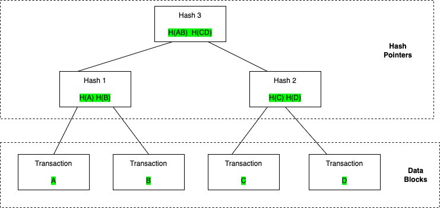

--- 
sidebar_position: 2
---

# Sparse Merkle Tree
要了解为什么用Sparse Merkle Tree(下面简称SMT)，先介绍下Merkle Tree

## Merkle Tree
Merkle Tree又被称为二叉哈希树，主要用在文件系统或者P2P系统中。下面这个图说明,
这里 A, B, C, D 四个交易在虚线框内，在 Merkle Tree属于 Data Blocks， 这部分叫做 LeafNode, 上面的虚线框属于Hash Pointer。
Hash 1的值是交易A的Hash值和交易B的Hash值拼接后计算的Hash值(也可以有其他算法)，在图中是H(A) H(B) Hash(1) = Hash(H(A) + H(B)) 这里 + 表示字符串拼接,
Hash 2的值是交易C和交易D的Hash值拼接后计算的Hash值，在图中是H(C) H(D), 其中Hash(2) = Hash(H(C) + H(D)),
Hash 3是Hash 1和Hash 2拼接计算的Hash值，在图中是H(AB) H(CD), Hash(3) = Hash(Hash(1) + Hash(2)),
Hash 3也叫做Root_Hash


Merkle Tree有以下作用

### 快速定位修改
如果交易 A 被修改后，Hash 1 也会被修改,Root_Hash 也会被修改，
所以可以认为记住 Root_Hash 就记住了整个 Merkle Tree

### 校验交易
这个树的作用可以检验交易是否有效 ,在区块链 Light Node不会记录所有交易数据, 只会记录Merkle Tree的Root_Hash值,
如果校验交易A是否存在, 这时候是把交易 A 的Hash值这里记为H(A)发送给校验放, 校验方发送一个Hash值列表[Hash(B), Hash(CD)],
如果保存的Root_Hash和Hash(Hash(H(A) + H(B)) + Hash(CD))相等, 证明交易A是存在的,这个过程叫做Merkle Proof

## SMT
### 介绍下为啥需要用SMT
starcoin是基于账户模型，不同于以太坊个人账户和合约账户是分开的, starcoin中合约相关信息也都存储在State中,
State包括合约代码(CODE)和资源(RESOURCE),余额相关信息都在RESOURCE中,需要数据结构来处理账户地址到账户状态的映射,
也就是AccountAddree -> State, 直观上来这个映射就是Key -> Value之间映射。
处理这个可以使用HashMap,系统中维护一个全局的HashMap,每次有新的账户创建就插入一对Key, Value,
查询账户余额就在HashMap中使用Key来查询,
不考虑Hash碰撞，查询基本是常数时间完成(O(1)),更新也是,
这种设计最大问题是不能提供Merkel Proof, 比如证明某个时间点这个账户余额大于多少(StateProof)。
一种想法是基于当时的HashMap构建Merkel Tree,
基于这种想法，每次有新的区块发布的需要基于HashMap构建新的Merkel Tree,
并将Merkel Tree对应的Root_Hash发布到BlockHeader中,
这个方案是有问题的，HashMap效率很高，但是每次构建Merkel Tree效率很低。
还有一种想法是我们不用HashMap，直接构建Merkel Tree把所有账户的状态都存下来,
这个方法的问题在于Merkel Tree没有提供高效查找和修改的方法,
这里使用了一种基于压缩Trie数据结构Jellyfish-Merkle-Tree (JMT)

### SMT设计原理
#### Merkle Tree到SMT
在starcoin中Hash的计算都是基于Sha3-256计算来的, 所以这颗树是2的256次方个元素
下图显示了Merkle Tree到SMT的两个优化

这里1显示了Merkel Tree形状，图2对其做了优化将空子树用PlaceHolder(方格)代替, 节省了空间,
图3优化将只含有一个叶子节点的子树设置成节点， 这样减少了Proof时候对Hash的计算,
这里A的2进制路径表示为0100, B的为1000， C的为1011

#### 基数树前缀压缩
下图显示了基于压缩的优化

这里图中的Merkle Tree的key的长度都是8个bit，是颗稀疏，有很多空节点,
A的2进制路径为00010100， 每4个bit压缩后变成右边的0x14,
B的2进制路径为00011010, 压缩后为0x1A,
C的2进制路径为00011111, 压缩后为0x1F,
D的2进制路径为11101100，压缩后为0xDC,
这里每4个bit压缩叫做一个Nibble,
Merkle Tree可以认为是基数等于2的基数树，图中右边可以认为是基数等于16的基数树,
SMT就是基于基数16的基数树(这里简称为Radix16),这个设计的优点就是降低树的高度,减少内存访问次数,降低内存,
这种Radix Tree叫做ADAPTIVE RADIX TREE(starcoin中固定为node16), 论文(https://db.in.tum.de/~leis/papers/ART.pdf) 有更多内容这里不介绍,
还有其他一些Radix Tree优化思路，比如以太坊使用的是改进版本的Patricia Radix Tree(https://eth.wiki/fundamentals/patricia-tree),
比如HAT RADIX TREE， 这些这里不介绍

### SMT数据结构和操作
上面提到SMT实际上是一个Radix16 Trie, 在starcoin中每个SMT中Key的长度是256bit,这里基于4个bit(一个Nibble)做了压缩,对于任意一个输入，我们计算Sha3-256后进行处理
这样整个树的高度就变为64,
SMT的节点类型分为Null, Internal, LeafNode,
Null就是前面提到的PlaceHolder, Internal最多有16个子节点(子节点类型可以是Internal或者LeafNode， 这里对应一个HashMap, Key为0-16)， LeafNode存储的是实际的Key, Value,
区块链中需要保存历史状态，这里如何查询某个key的历史状态，之前提到Merkle Tree里保存Root_Hash就认为是保存了整棵树,查询中需要历史Key某个状态,
需要提供树的根节点值和查询的Key，这个根节点就是在BlockHeader中的state_root, 这也是后续讲到StateTree的构建需要用到state_root,
starcoin中SMT需要持久化到KvStore, 这里用的是RocksDB(测试中MockTreeStore使用的是HashMap + BTreeSet),
为了将整个SMT保存在KvStore中, SMT的所有节点都只存储Hash值(对应的内容通过KvStore查询),
例如查找key为Hello对应的Value, 在SMT中计算Key_Hash = Sha3_256("hello"), 操作都是对Key_Hash进行,
需要将Null, Internal, LeafNode节点序列化存储在KvStore中

这里说明下starcoin中各种节点
```rust
pub struct Child {
    // The hash value of this child node.
    pub hash: HashValue,
    // Whether the child is a leaf node.
    pub is_leaf: bool,
}
pub type Children = HashMap<Nibble, Child>;

pub struct InternalNode {
    // Up to 16 Children.
    Children: Children,
    //Node's hash cache
    cached_hash: Cell<Option<HashValue>>,
}
pub trait RawKey: Clone + Ord {
    /// Raw key's hash, will used as tree's nibble path
    /// Directly use origin byte's sha3_256 hash, do not use CryptoHash to add salt.
    fn key_hash(&self) -> HashValue {
        HashValue::sha3_256_of(
            self.encode_key()
                .expect("Serialize key failed when hash.")
                .as_slice(),
        )
    }

    /// Encode the raw key, the raw key's bytes will store to leaf node.
    fn encode_key(&self) -> Result<Vec<u8>>;

    fn decode_key(bytes: &[u8]) -> Result<Self>;
}

pub struct LeafNode<K: RawKey> {
    /// The origin key associated with this leaf node's Blob.
    #[serde(
    deserialize_with = "deserialize_raw_key",
    serialize_with = "serialize_raw_key"
    )]
    raw_key: K,
    /// The hash of the blob.
    blob_hash: HashValue,
    /// The blob associated with `raw_key`.
    blob: Blob,
    #[serde(skip)]
    cached_hash: Cell<Option<HashValue>>,
}
```
Child的定义可以看到只存储了Hash值，Value通过KvStore.get(Hash)获取, 然后再反序列化确定是Internal还是LeafNode

下面说明下各个操作流程
## 在空树种创建LeafNode例子
我们在一颗空树种插入 Key "Hello", Value "World",
基于这个产生一个叶子节点和叶子节点的Hash值,这个Hash值就是SMT新的根节点,
Hash值和LeafNode序列化后插入到KvStore中,


## 插入流程
在starcoin中Hash值是256 bit, 画图不方便，这里用短点地址16 bit做例子

### 空树插入叶子
开始为空SMT,插入一个Key1, Value1, 生成的LeafNode1的Hash1为0x1234,
这个是新的根节点, 如下图


### 新插入叶子节点和某个叶子节点有公共前缀
在上面基础下新插入Key2, Value2, 需要查找Key2插入的位置, 先计算Key2的Key2_Hash = Hash(Key2),
假设Key2_Hash值为0x1236, Key2_Hash和Root_Hash1有公共前缀0x123, 先由 Key2, Value2生成一个LeafNode2, 
由于LeafNode1和LeafNode2有公共前缀，需要生成一个Internal,记为Children1 ,其中 Children1[4] = Hash(LeafNode1), Children1[6] = Hash(LeafNode2),
公共前缀0x1, 0x12也需要生成Internal， 这里先构造0x12的Internal记为Children2, Children2[3] = Hash(Children1),
然后构造0x1的Internal Children3, Children3[2]= Hash(Children2),
LeafNode2, Children1, Children2, Children3按照Hash和序列化的值写入到KvStore,
新生成的根节点是Hash(Children3)


### 新插入叶子结点和某个内部节点有公共前缀
#### 内部节点插入新子节点
在上面基础上，假定插入Key3, Value3,
假定插入Key3的hash值Key3_Hash为0x35ef, Children3的Index 3的子节点为空, 将Key3, Value3生成新的叶子节点LeafNode3,
Children3[3] = hash(LeafNode3),
将LeafNode3, Children3按照Hash和序列化的的值写入到KvStore, 新生成的根节点是Hash(Children3),
如下面这图，这种情况对应当前Internal添加新的子节点,


#### 内部节点更新子节点
假定插入Key3_Hash值为0x25ef, Children3的Index 2的子节点为Children2, 递归处理在Children2插入,
更新Children2, 更新Children3[2] = Hash(Children2),
将Children2, Children3按照Hash和序列化值写入到KvStore,新生成的根节点是Hash(Children3),
如下面这图，这种情况对应当前Internal修改已存在的子节点,需要递归处理


## 查询流程
在上面流程基础上，假设要查询的Key4, 先计算Key4的Key4_hash = Hash(key4), 在starcoin中Key_Hash4是个256 bit的值，也就是64个Nibble(一个Nibble为4bit), 记为Nibble0..Nibble63,
查找先从根节点Root_Hash获取根节点对应Node,查看Node是LeafNode还是Internal,
[1]如果是LeafNode,查看下LeafNode对应的Key的Hash值是否和Key4_Hash相等，相等就返回结果, 不相等返回None,
[2]如果是IntenalNode 查找Internal对应Nibblei的子节点(初始i = 0，每次i++), 查找到新Node是LeafNode,走条件1, 否则跳转到[2],
流程图在下面(代码get_proof_with),


## SMT API 相关说明
### new
```rust
pub fn new(TreeReader: &'a) -> Self {
    
}
```
这里TreeReader是一个trait(可以认为是类似Java中inteface)， 在starcoin中是提供Key Value操作的数据结构,
在starcoin中对应的KvStore是RocksDB, MockTreeStore中使是HashMap + BTeeSet,
有TreeReader就有TreeWriter，这里TreeReader对应的是JMT的查找和在内存中的计算, TreeWriter对应的是持久化到KvStore操作,
starcoin持久层并没有实现TreeWriter trait, 现在直接写KvStore, Mock操作的MockTreeStore使用了TreeWriter,
可以简单认为SMT是内存中一颗Trie树，持久化在RocksDB上

### updates
```rust
pub fn updates(&self,
    state_root_hash: Option<HashValue>,
    blob_set: Vec<(KEY, Vec<u8>)>
    ) -> Result<(HashValue, TreeUpdateBatch<KEY>)>;

pub struct StaleNodeIndex {
    pub stale_since_version: HashValue,
    pub node_key: HashValue,
}

pub struct TreeUpdateBatch<KEY> {
    pub node_batch: BTreeMap<HashValue, Node<KEY>>,
    pub stale_node_index_batch: BTreeSet<StaleNodeIndex>,
    pub num_new_leaves: usize,
    pub num_stale_leaves: usize,
}
```
这里HashValue就是之前提到的Sha3_256的计算值,
这里说明下各个参数,
state_root_hash是某个SMT树的根节点Hash值，通过Hash值唯一确定了这颗SMT树，
blob_set是Key, Value列表，
这么设计是为了一个Block执行交易后满足幂等性 这里state_root_hash等于前一个BlockHeader中的state_root(SMT的Root_Hash值),
返回值```Result<(HashValue, TreeUpdateBatch<KEY>)>``` HashValue代表新的SMT的Hash值, 这个新的HashValue存储在BlockHeader中的state_root,
返回值中TreeUpdateBatch 里面的node_batch, 这里比如我们blob_set是{(Key1, Value1), (Key2, Value2}, SMT会产生LeafNode和Internal, 会把这些按照Hash值和自身存到BTreeMap中,
StaleNodeIndex中stale_since_version是这次新产生的根节点Hash, node_key是被修改过的Node的Hash

### get_proof_with
```rust
pub fn get_with_proof(&self, key: &K) -> Result<(Option<Vec<u8>>, SparseMerkleProof)>
```
获取Key对应的Value的值，如果存在并返回对应的Merkel Proof证明


相关资源[draw.io](../../../../../static/smt.drawio)